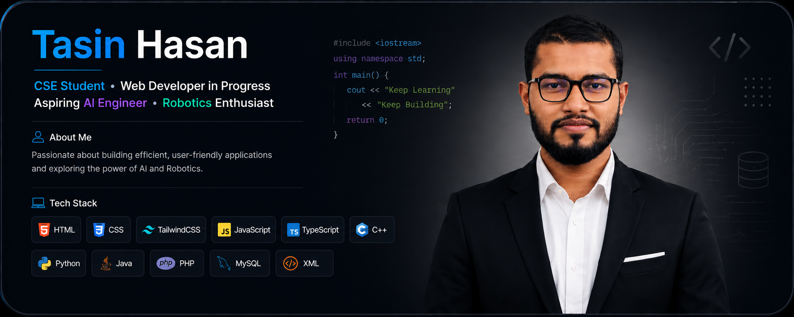

<p align="center">
  
</p>


<h1 align="center">Hi, I'm Tasin Hasan 👋</h1>

<p align="center">
  
</p>


## 👨‍💻 About Me

I'm a Computer Science & Engineering student who enjoys building software and learning how technology can solve real-world problems. I'm currently learning Web Development with the goal of becoming a Full-Stack Developer.

- 🌱 Building my skills through hands-on projects
- 💻 Interested in Web Development and Software Engineering
- 🧠 Focused on improving my programming and problem-solving skills
- 🤖 Aspiring to work in Artificial Intelligence and Robotics
- 🚀 Always learning, building, and experimenting with new technologies


<br><br>


## 🌱 Currently Learning

- ⚛️ React
- ⚙️ Backend Development — Node.js & Express.js
- 🔐 Authentication & REST APIs
- 🚀 Deployment & Cloud Technologies


<br> <br>


## 🛠️ Tech Stack

### 💻 Programming Languages

<p>
  
  
  
  
  
  
  
</p>

<br>

### 🌐 Frontend Development

<p>
  
  
  
  
  
</p>

<br>

### 🗄️ Database

<p>
  
</p>

<br>

### 🔧 Tools & Technologies

<p>
  
  
  
  
  
  
</p>


<br> <br>


## 📊 GitHub Stats

<p align="center">
  <picture>
    <source media="(prefers-color-scheme: dark)"
      srcset="https://raw.githubusercontent.com/tasin-hasan/tasin-hasan/output/github-contribution-grid-snake-dark.svg">

```
<source media="(prefers-color-scheme: light)"
  srcset="https://raw.githubusercontent.com/tasin-hasan/tasin-hasan/output/github-contribution-grid-snake.svg">


```

  </picture>
</p>

<br>

<p align="center">
  
  
</p>


